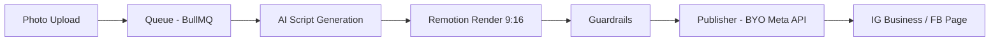

# ReelAutoFly

BYO API platform: bring your own Instagram Graph API token, upload a product photo, auto-create 9:16 Reel, and auto-publish to IG Business and FB Page via official Meta Content Publishing API.

## Architecture



## Monorepo

- `apps/web` — Next.js 15 frontend
- `apps/api` — FastAPI backend
- `apps/worker` — BullMQ background worker
- `apps/publisher` — Meta API publishing microservice
- `packages/db` — Prisma + PostgreSQL schema
- `packages/shared` — Zod schemas and shared types
- `packages/remotion-templates` — Remotion project templates

## Getting Started

```bash
pnpm install
cp .env.example .env
pnpm dev
```
